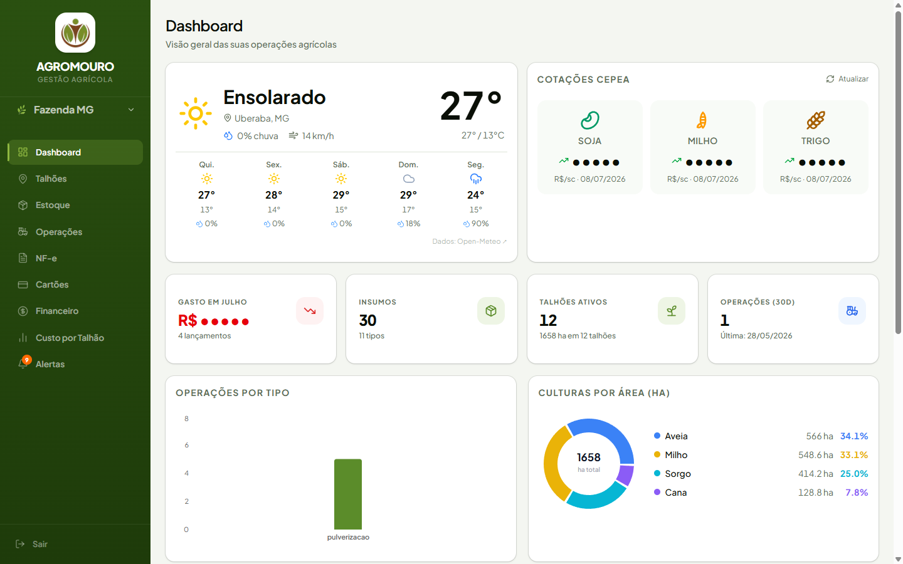
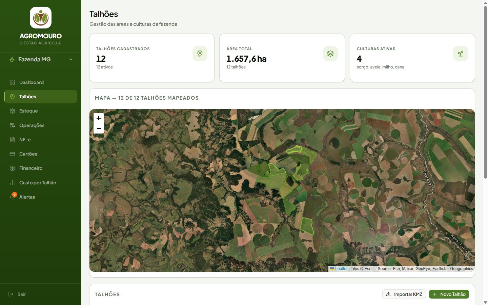
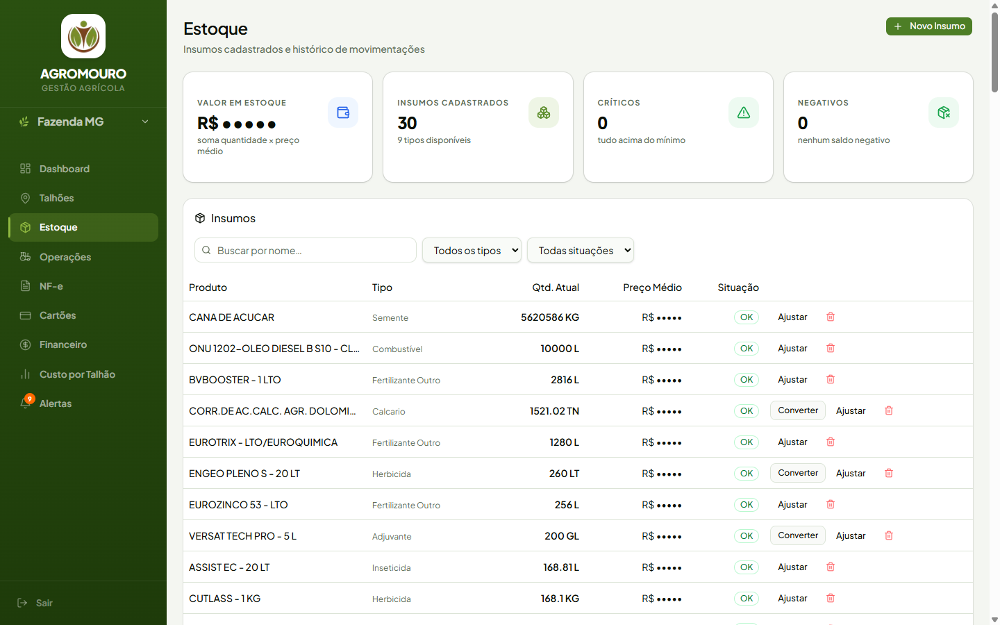
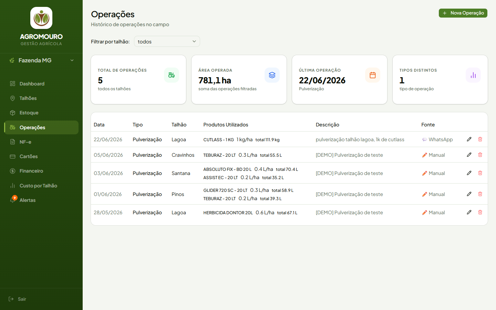
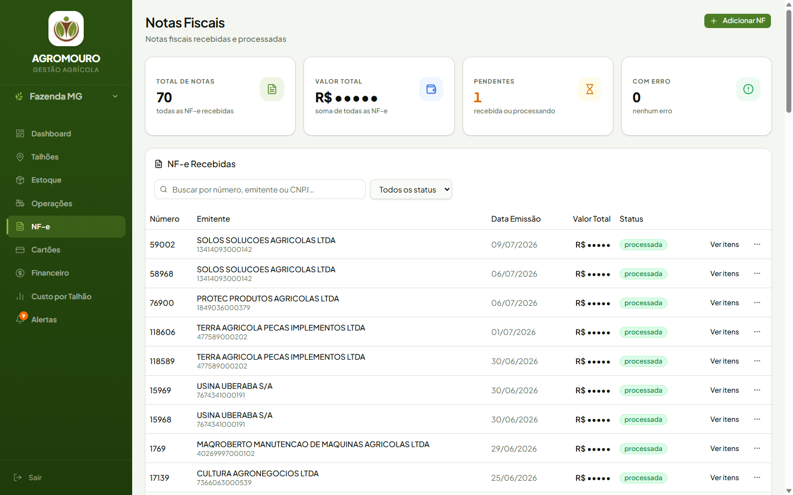
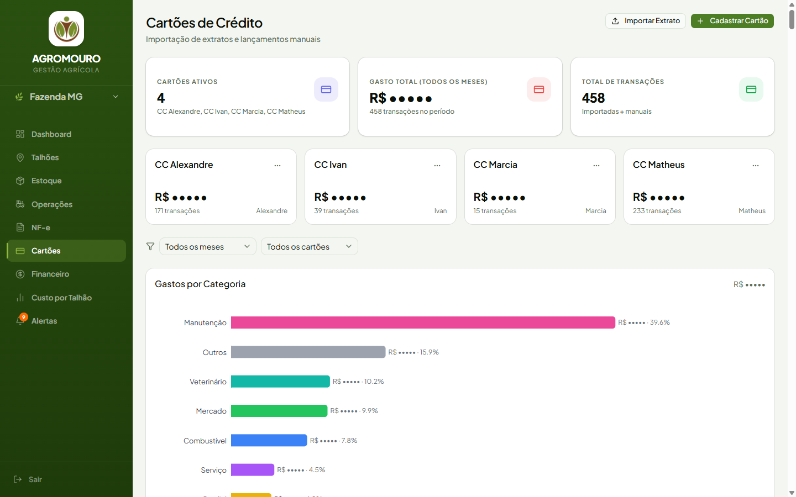
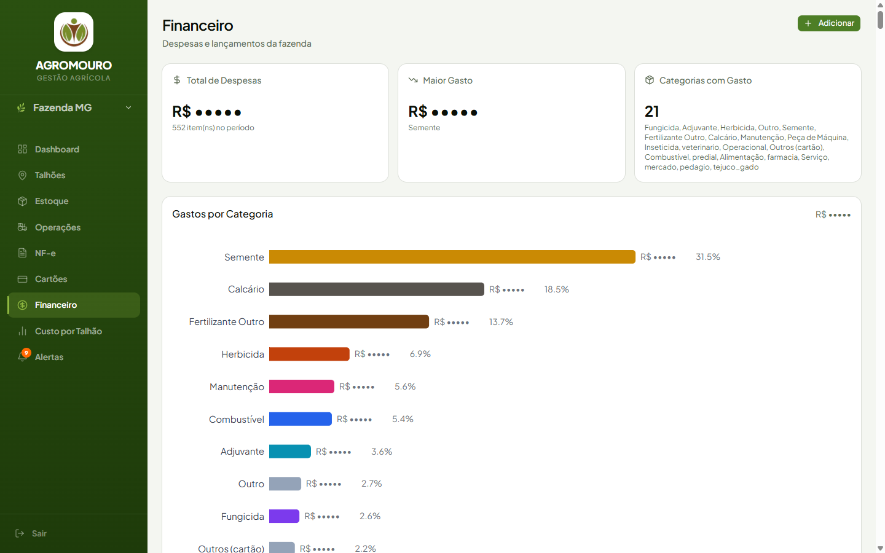
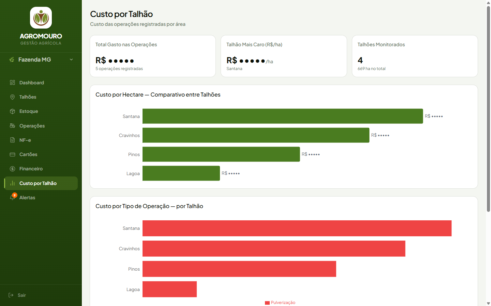
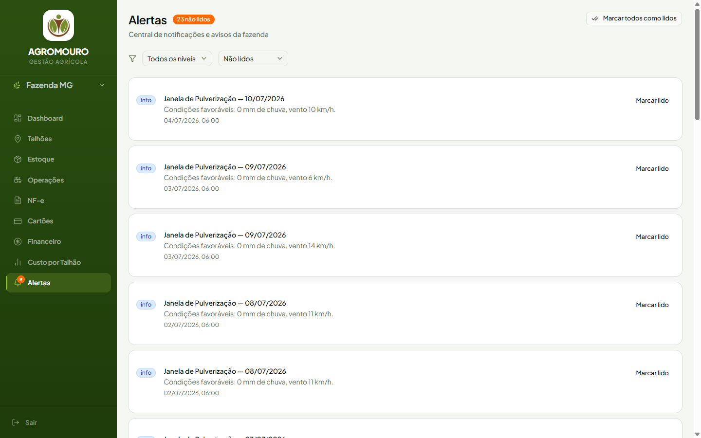

# 🌱 AgroMouro

> Farm management platform for grain farms (soybean, corn, wheat).
> The farmer runs everything through **WhatsApp** — the system collects the data
> on its own (e-invoices, weather, commodity prices) and only interrupts when
> there's no other way.

---

## What it is

Rural producers aren't technical and don't want to fill in spreadsheets. AgroMouro
flips the effort: instead of asking for data, it **captures it automatically** and
cross-references everything to give full visibility of the farm with no manual work.

- 📲 **WhatsApp** — the farmer logs field operations in natural language; Claude parses them.
- 🧾 **Automatic e-invoices** — supplier invoices arrive by email, get parsed, and become stock + expense entries.
- 🌦️ **Weather & prices** — frost/spraying alerts and daily CEPEA prices (soybean, corn, wheat).
- 📊 **Web panel** — dashboard, stock, operations, fields, finance, and alerts in one place.

---

## Screenshots

> 💰 Monetary values are masked (`R$ •••••`) — the data belongs to a real, operating farm.



| | |
|---|---|
| **Fields** — satellite map + KMZ import  | **Stock** — inputs with average price and unit conversion  |
| **Operations** — field history with dosage per hectare  | **E-invoices** — parsed automatically from supplier emails  |
| **Credit cards** — statement import + auto-categorization  | **Finance** — expenses by category, fed by e-invoices  |
| **Cost per field** — R$/ha comparison across fields  | **Alerts** — spraying windows, frost, low stock  |

---

## Architecture

```
                          ┌─────────────────────────┐
   Supplier ──(email)────▶│  Make.com (every 15 min) │──┐
                          └─────────────────────────┘  │  e-invoice XML
                                                        ▼
  Farmer ──(WhatsApp)──────▶ Z-API ──▶ ┌──────────────────────────┐
                                       │   API (Node + Express)    │
   Weather / CEPEA ──(cron)──────────▶ │   Railway                 │
                                       └────────────┬─────────────┘
                                                    │
                                          ┌─────────▼─────────┐
                                          │  Supabase (Postgres│
                                          │  + Auth + RLS)     │
                                          └─────────▲─────────┘
                                                    │
   Farmer ──(browser)────────▶ ┌────────────────────┴─────────────┐
                               │   Web (Next.js 16 + Tailwind)     │
                               │   Vercel                          │
                               └──────────────────────────────────┘
```

| Layer | Stack | Deploy |
|--------|-------|--------|
| **api/** | Node.js · Express · TypeScript | Railway |
| **web/** | Next.js 16 (App Router) · Tailwind · shadcn/ui | Vercel |
| **Database** | Supabase — PostgreSQL + Auth + RLS + Realtime | Supabase Cloud |
| **WhatsApp** | Z-API + Claude Haiku (message parsing) | — |
| **E-invoice** | Make.com watches Outlook inboxes → `POST /webhook/nfe-email` | — |
| **AI** | Anthropic Claude (Haiku: parsing · Sonnet: soil prescriptions) | — |

> ℹ️ **E-invoicing is 100% automatic.** Make.com watches two Outlook inboxes every
> 15 min and sends the XML to the API. There is no manual step.

---

## Monorepo structure

```
agromouro-base/
├── api/                  # Backend — Node + Express + TypeScript (Railway)
│   └── src/
│       ├── routes/       # REST routes: fields, stock, operations, alerts, cards
│       ├── services/     # Business logic: supabase, zapi, nfeProcessor, categorizer
│       ├── webhooks/     # External events: whatsapp, nfe, nfeEmail
│       ├── jobs/         # node-cron: weather (06:00), prices (06:30), e-invoice email (30 min)
│       ├── middleware/   # auth, errorHandler, requestLogger, validateWebhook
│       ├── database/     # schema.sql, seed.sql, migrations/
│       └── index.ts      # application entry point
├── web/                  # Frontend — Next.js 16 (Vercel) — see web/README.md
│   └── app/(app)/        # dashboard, stock, operations, fields, e-invoices, cards,
│                         # finance, costs, alerts
├── supabase/             # Supabase project configuration
├── docs/                 # documentation, audits, and Make.com setup
├── .env.example          # all environment variables, commented
└── PLAN.md               # detailed product plan and roadmap
```

---

## Running locally

**Prerequisites:** Node.js 20+, a Supabase account, Z-API and Anthropic credentials.

### 1. Environment variables

```bash
cp .env.example .env
# Fill in your credentials (Supabase, Z-API, Anthropic, etc.)
```

The same root `.env` is used by the API (`npm run dev` reads `../.env`).

### 2. API (backend)

```bash
cd api
npm install
npm run dev
# → http://localhost:3001/health
```

On startup the API validates the required variables
(`SUPABASE_URL`, `SUPABASE_SERVICE_KEY`, `SUPABASE_ANON_KEY`, `WEBHOOK_SECRET`)
and warns about the optional ones (Z-API, Anthropic).

### 3. Web (frontend)

```bash
cd web
npm install
npm run dev
# → http://localhost:3000
```

> Set the Supabase `NEXT_PUBLIC_*` variables for the frontend. Details in [web/README.md](web/README.md).

---

## Database (MVP)

Main tables: `fazenda`, `talhoes`, `safras`, `operacoes`, `insumos`,
`estoque`, `movimentacoes_estoque`, `notas_fiscais`, `itens_nfe`,
`lancamentos_financeiros`, `alertas`.

Schema and migrations are versioned in [api/src/database/](api/src/database/).
Access is protected by **Row Level Security (RLS)** in Supabase.

---

## Deploy

| Service | Platform | Notes |
|---------|----------|-------|
| API | **Railway** | `npm run build` → `npm start`. Config in `api/nixpacks.toml`. |
| Web | **Vercel** | Automatic Next.js build from `web/`. |
| Database | **Supabase** | Managed PostgreSQL + Auth. |

Set all environment variables in each service's dashboard — **never commit `.env`**.

---

## Security

- `.env` is in `.gitignore` — secrets never reach Git.
- External webhooks have their own origin validation (`validateWebhook`) + rate limiting.
- API routes are protected by Supabase authentication (`requireAuth`).
- Helmet, allowlist-based CORS, and global rate limiting are active on the API.

---

## Roadmap (post-MVP)

John Deere Operations Center · Stara Hércules 6.0 · Open Finance (Pluggy) ·
NDVI via Sentinel Hub · IoT sensors (LoRaWAN/TTN).

Details and priorities in [PLAN.md](PLAN.md).

---

## Credits

Built by [Matheus Dib Mouro](https://www.linkedin.com/in/matheus-dib-26b458160/) — AI Automation Developer (Serafim IA).
